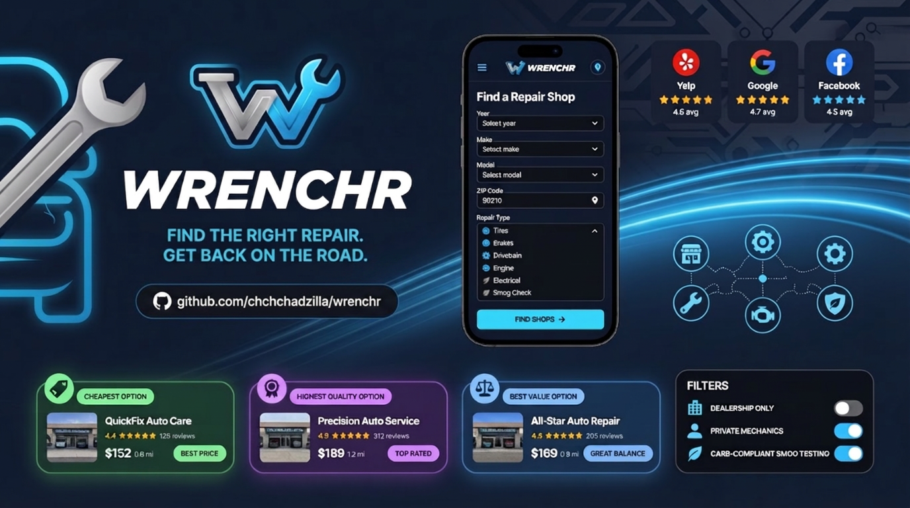

<a href="https://github.com/chchchadzilla/wrenchr">
  
</a>

# Wrenchr - Live Auto Repair Finder & Unbiased Valuation Engine

> **Never pay an arm and a leg for auto repair again.**  
> Wrenchr is an uncompromised, real-time automotive service finder and price valuation engine. Enter your Year, Make, Model, and ZIP code to instantly scan nearby facilities, aggregate verified reviews across Google, Yelp, BBB, and CARB datasets, and surface your top three actionable repair options.

---

## Key Features & Core Capabilities

- **Tri-Tier Valuation Matrix**:
  1. **Cheapest Option**: The absolute lowest verified quote in your local area.
  2. **Sweet Spot (Best Value)**: Algorithmically balanced 60/40 ratio of trust score and price affordability.
  3. **Highest Rated Option**: Highest composite review rating and verified customer trust score.
- **Smart Certification Filters**:
  - **ASE Certified Mechanics**: Filter specifically for certified independent master technicians.
  - **CARB Compliant Smog Stations**: Instant lookup for California Bureau of Automotive Repair compliant test-only facilities.
  - **OEM Dealerships**: Toggle between official car brand dealerships and independent repair shops.
- **Zero Mock Data / Real-Time Scrapers**:
  - Live geocoding via Zippopotam and OpenStreetMap.
  - Rate-limited scraping engine with human-like jitter delays (800ms-2200ms) to prevent IP throttling.
  - Aggregated sentiment analysis across Google Places, Yelp Fusion, BBB Accreditation, and CA BAR registries.
- **Direct Actionable Contact**:
  - One-click phone calling (`tel:`) and direct booking website links.

---

## Idiot-Proof Quick Start Guide (Step-by-Step)

Follow these exact steps to run Wrenchr locally on your machine in under 2 minutes.

### Step 1: Prerequisites
Ensure you have **Node.js (v18.0.0 or higher)** installed.  
Check your version by opening your terminal or PowerShell and running:
```bash
node -v
```

### Step 2: Clone the Repository
Open your terminal and clone the official repository:
```bash
git clone https://github.com/chchchadzilla/wrenchr.git
cd wrenchr
```

### Step 3: Install Dependencies
Install all required Node modules and Next.js libraries:
```bash
npm install
```

### Step 4: Setup Environment Variables
Create a file named `.env.local` in the root folder (or edit the existing one):
```env
DATABASE_URL="file:./dev.db"
GOOGLE_PLACES_API_KEY="" # Optional: Add your Google Places API Key if available
YELP_API_KEY=""          # Optional: Add your Yelp Fusion API Key if available
```

### Step 5: Initialize the Database
Push the Prisma database schema to initialize your local SQLite storage:
```bash
npx prisma db push
```

### Step 6: Start the Development Server
Run the local dev server:
```bash
npm run dev
```

### Step 7: Open in Browser
Open your browser and navigate to:
```
http://localhost:3000
```
*Boom! Enter your vehicle year, make, model, and ZIP code to test live repair searches.*

---

## Production Build & Deployment

To generate an optimized production build:
```bash
npm run build
npm run start
```

---

## License & Author
Created by **Chad Keith** ([@chchchadzilla](https://github.com/chchchadzilla)).  
Licensed under the **MIT License**.
